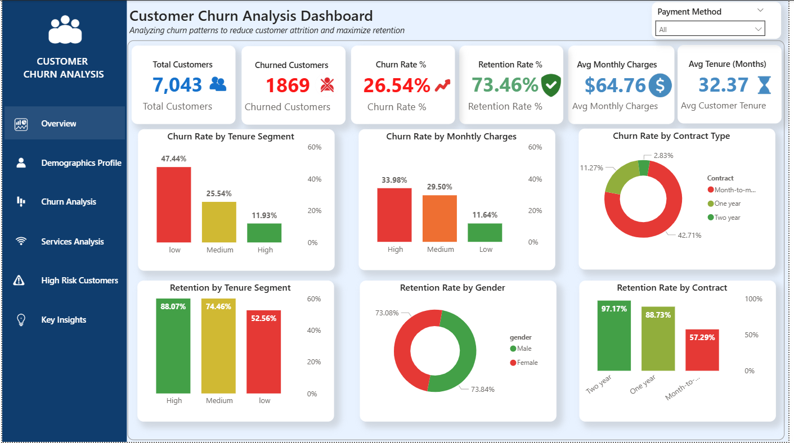

# Customer Churn & Retention Analysis

An end-to-end customer churn analysis project using PostgreSQL, Python, Pandas, and Power BI to identify churn patterns, high-risk customer segments, and actionable retention opportunities.

---

## 📌 Project Overview

Customer churn is a major business challenge for subscription-based businesses. This project analyzes customer demographics, services, contract types, payment methods, tenure, and monthly charges to understand the factors associated with customer churn.

The analysis combines SQL-based segmentation, Python/Pandas exploratory analysis, and an interactive Power BI dashboard to turn customer data into actionable business insights.

---

## 🎯 Business Problem

The business wants to understand:

- Which customer segments have higher churn?
- Which contract types are associated with customer retention or churn?
- How do tenure and monthly charges relate to churn?
- Which internet and payment-method segments show higher churn?
- Can customers with multiple high-risk characteristics be identified?
- What retention strategies can be targeted toward high-risk customers?

---

## 🎯 Project Objectives

- Analyze overall customer churn and retention.
- Identify major churn-associated factors.
- Segment customers based on tenure and monthly charges.
- Analyze churn across customer demographics and services.
- Identify customers with multiple high-risk characteristics.
- Develop actionable customer retention recommendations.
- Build an interactive Power BI dashboard for business users.

---

## 📊 Dataset

The dataset contains **7,043 customers** and includes information about:

- Customer demographics
- Tenure
- Phone and internet services
- Online security and backup
- Device protection
- Technical support
- Streaming services
- Contract type
- Payment method
- Monthly charges
- Total charges
- Churn status

---

## 🛠️ Tools & Technologies

| Tool | Purpose |
|---|---|
| PostgreSQL | Data analysis, segmentation and business queries |
| Python | Exploratory data analysis |
| Pandas | Data cleaning and analysis |
| Power BI | Data visualization and dashboard development |
| DAX | KPI calculations and dashboard measures |
| GitHub | Project documentation and portfolio |

---

## 🔄 Project Workflow

```text
Raw Dataset
     ↓
Data Understanding
     ↓
Data Cleaning & Validation
     ↓
PostgreSQL Analysis
     ↓
Python / Pandas EDA
     ↓
Power BI Data Modeling
     ↓
DAX Measures
     ↓
Interactive Dashboard
     ↓
Business Insights
     ↓
Retention Recommendations
```
---

## 🧹 Data Cleaning & Preparation

The dataset was reviewed for:

- Duplicate customer records
- Missing values
- Data types
- Numeric fields
- Categorical values
- Invalid or inconsistent records

`TotalCharges` required type conversion for analysis, and missing values were identified for customers with zero tenure.

---

## 🗄️ SQL Analysis

PostgreSQL was used to perform structured business analysis, including:

- Overall churn analysis
- Churn rate by demographic factors
- Churn by contract type
- Churn by internet service
- Churn by payment method
- Churn by tenure segments
- Churn by monthly-charge segments
- Service-level churn analysis
- Retention analysis
- Multi-factor churn analysis
- High-risk customer identification

### Key SQL Techniques Used

- `GROUP BY`
- `CASE`
- `FILTER`
- `COUNT`
- `ROUND`
- CTEs
- Conditional aggregation
- Segmentation
- Multi-factor analysis

---

## 🐍 Python & Pandas Analysis

Python and Pandas were used for exploratory data analysis and validation.

The analysis covered:

- Dataset structure and dimensions
- Missing-value analysis
- Duplicate checking
- Unique customer identification
- Churn distribution
- Categorical distributions
- Numerical summaries
- Customer segmentation
- Relationship between customer characteristics and churn

---

## 📈 Power BI Dashboard

The Power BI dashboard provides an interactive view of customer churn and retention patterns.

### Dashboard Sections

- Overview
- Churn Analysis
- Demographics Profile
- Services Analysis
- Key Insights

The dashboard includes KPI cards, charts, customer segmentation, churn analysis, and high-risk customer analysis.

---

## 🔑 Key Insights

The analysis indicates that customer churn is strongly associated with several customer characteristics:

- **Month-to-month contracts** show higher churn risk.
- **Short-tenure customers**, particularly those in the first 12 months, require greater retention attention.
- **Higher monthly charges** are associated with increased churn.
- **Fiber optic** customers show elevated churn.
- **Electronic check** users represent a higher-risk payment segment.
- Customers with multiple high-risk characteristics can be prioritized for targeted retention campaigns.

---

## 💡 Business Recommendations

### 1. Strengthen New-Customer Onboarding

Customers in their first 12 months should receive stronger onboarding, regular follow-ups, and early-stage engagement offers.

### 2. Encourage Long-Term Contracts

Month-to-month customers can be encouraged to move toward one-year or two-year contracts through suitable discounts and loyalty benefits.

### 3. Review High Monthly Charges

Customers with high monthly charges should be evaluated for pricing, plan value, and personalized offers.

### 4. Target High-Risk Segments

Customers showing multiple high-risk characteristics should be prioritized for proactive retention campaigns.

### 5. Investigate High-Risk Service Segments

Internet-service segments with elevated churn should be investigated for service quality, pricing, and customer-support issues.

### 6. Improve Payment Experience

Payment methods associated with higher churn should be reviewed, with easier payment options and suitable incentives considered.

---

## 📁 Project Structure

```text
customer-churn-analysis/
│
├── Images/
│   ├── Churn Analysis.png
│   ├── Demographics Profile.png
│   ├── Key Insight.png
│   ├── Overview.png
│   └── Services Analysis.png
│
├── PowerBI/
│   └── churn Analysis Dashboard.pbix
│
├── Python/
│   └── CustomerChurnRetentionAnalysis.ipynb
│
├── SQL/
│   └── customer_churn.sql
│
└── README.md
```
---

## 📸 Dashboard Preview

### 1. Overview



### 2. Demographics Profile


### 3. Churn Analysis


### 4. Services Analysis


### 5. High Risk


### 6. Key Insights


---

## 🚀 Conclusion

This project demonstrates an end-to-end analytics workflow, from data cleaning and SQL analysis to Python-based EDA and Power BI dashboard development.

The analysis focuses on identifying customer segments associated with higher churn risk and translating those findings into practical retention strategies.

---

## 👤 Author

**Arman Haider Zaidi**

Aspiring Data Analyst | SQL | Python | Pandas | Power BI | Excel
